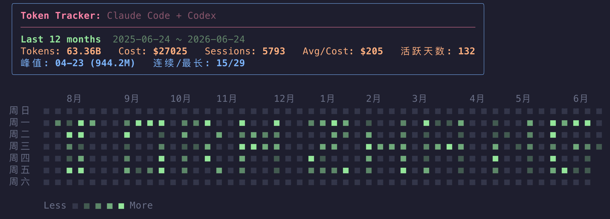
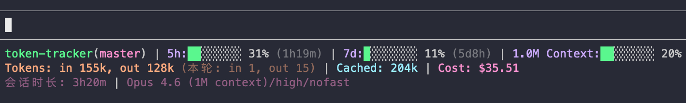
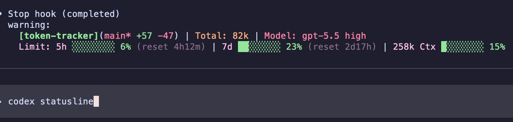
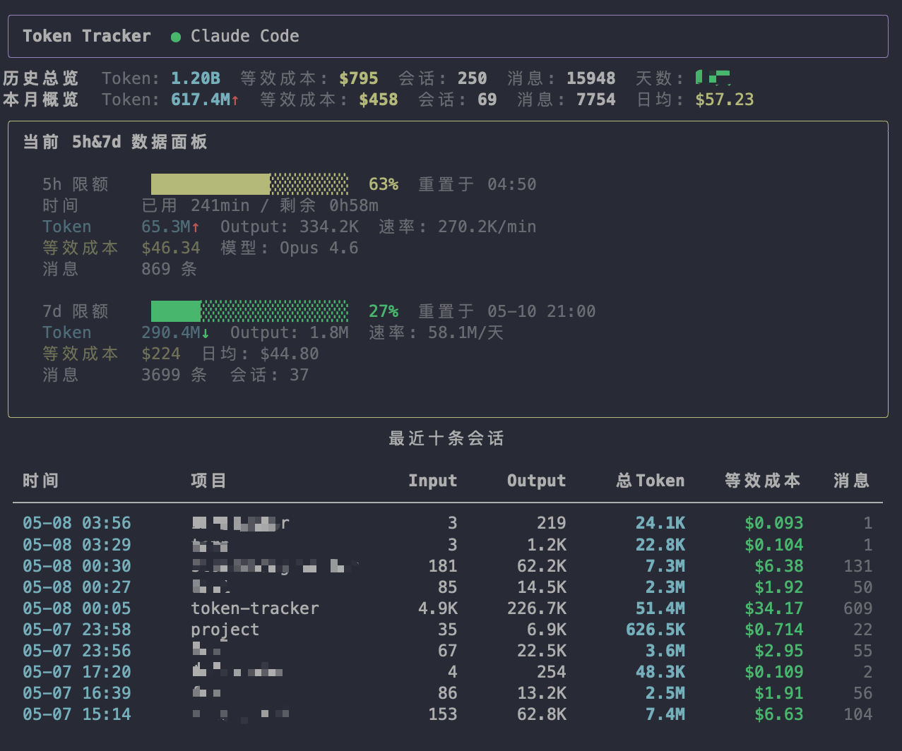
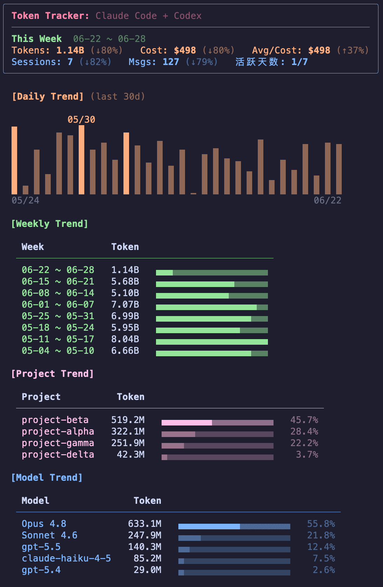
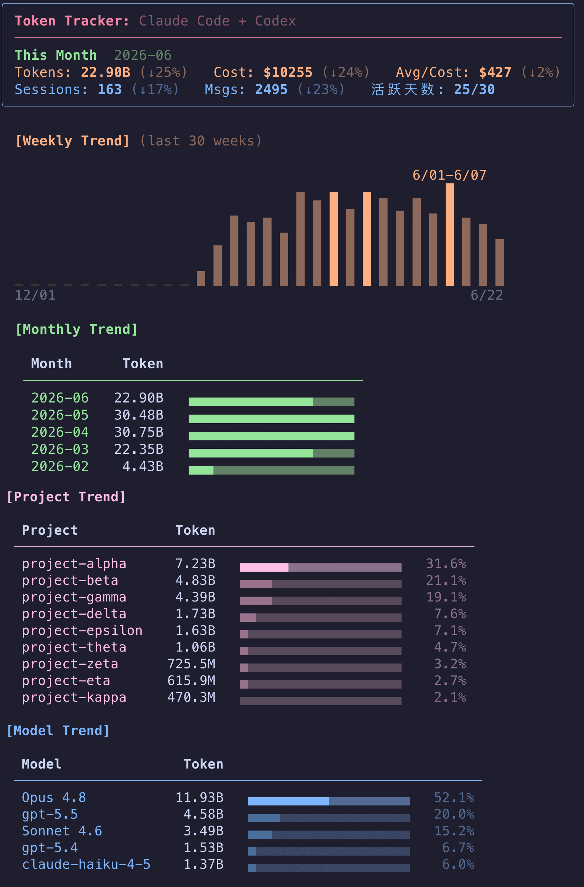
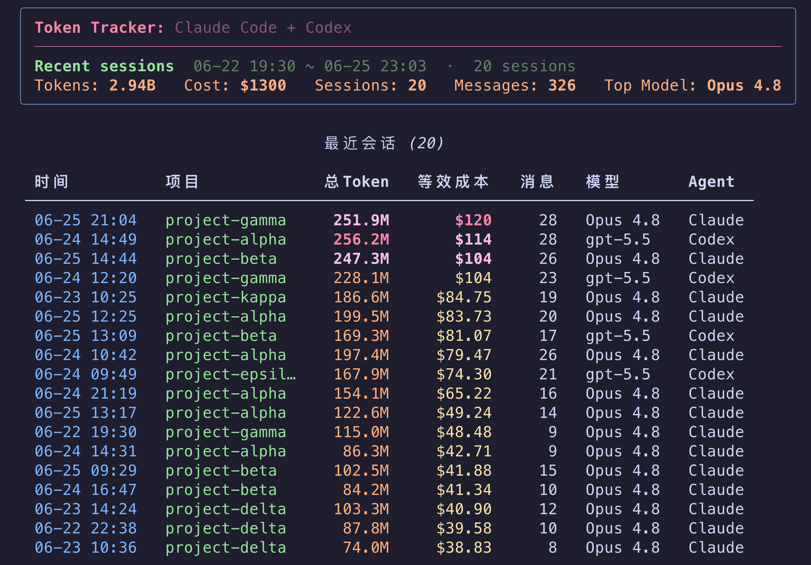
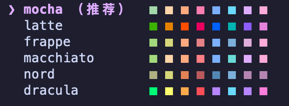

# Token Tracker

Track token usage across local AI agents. Supports **Claude Code** and **Codex**.

Custom StatusLine integration + CLI Dashboard — see token usage, cost, and rate limits at a glance.

  

[中文](README.md)



## Highlights

- **Unified multi-agent tracking** — Claude Code + Codex in one place, grouped by source
- **Status line integration** — Claude Code via official StatusLine API; **Codex industry-first faux statusline** (hook-injected two-line truecolor status — bringing an official-unsupported capability to Codex)
- **Rate limit monitoring** — real-time 5h / 7d quota usage with reset countdown
- **Multi-dimensional cost analysis** — per-session, daily, weekly, monthly cost breakdown
- **Pricing resolution** — litellm live pricing + built-in official-price fallback, covering Claude / OpenAI / Gemini / Grok and major Chinese models (Kimi / GLM / Qwen / Doubao / DeepSeek / MiniMax / MiMo); new family members auto-priced, never silently $0
- **Session insights** — project, model, duration, message count per session
- **Unified multi-theme** — 6 themes (Catppuccin family + Nord + Dracula) shared across CLI reports, the CC status line, and the Codex faux statusline; switch with `tt theme`
- **Zero config** — auto-detects installed agents, reads local data directly
- **Privacy first** — all data stays local, no collection or upload

## StatusLine

`tt setup` auto-configures status lines for Claude Code and Codex, auto-upgraded when the script updates.

### Claude Code (official API)

Built on the Claude Code official custom StatusLine API — **all data comes directly from local Claude, zero guesswork**.

> The status line takeover is **optional**: if you already have a custom statusLine, it is kept by default (you can also pick No in the wizard anytime), and report commands work regardless. Note: without the takeover, the CC subscription rate-limit section in `tt status` has no data source (CC quota is only persisted via the status line script).



<details>
<summary>Four-row layout field details</summary>

| Row | Field | Description |
|-----|-------|-------------|
| 1 | `[project](branch +12 -3)` | Project name (bold) + Git branch (`*` = uncommitted), with added/removed lines vs HEAD in parens |
| 1 | `Total: 1.2M` | Cumulative tokens consumed this session (input+output+cache, parsed from transcript) |
| 1 | `Cost: $35.51` | Session cost (from Claude Code itself, official billing, accurate) |
| 1 | `Code: +208 -8` | Lines of code written / removed by Claude this session (`+` green `-` red, same as git diff) |
| 2 | `Limit: 5h: ██░ 31% (1h19m)` | 5-hour sliding window quota (subscription only; reset countdown in parens) |
| 2 | `7d: ██░ 11% (5d8h)` | 7-day sliding window quota |
| 2 | `1.0M Ctx: ██░ 20%` | Total context window size and usage percentage |
| 3 | `Tokens: in 392k, out 937, cache 388k` | **Current context window** token breakdown (note: not session cumulative; changes on compact) |
| 3 | `Out TPS: 60 tokens/s` | Current-turn output token generation speed (includes thinking; idle frames keep last value) |
| 4 | `Model: Opus 4.8/xhigh/nofast` | Model / reasoning level / fast mode status |
| 4 | `Duration: 1h33m` | Current session elapsed time |
| 4 | `Remote: github` | Code repository host (top-level domain stripped) |

> When terminal width is limited, the display auto-degrades: first hides reset countdowns, then simplifies progress bars to plain percentages. **API mode** has no subscription quota, so row 2 shows only Ctx.

</details>

### Codex (faux statusline — industry-first)

Codex doesn't yet support custom StatusLine. Token Tracker injects a **faux statusline** via a hook — after each turn completes, two truecolor status lines are appended to the response. **This is a rare implementation that brings a status line to Codex despite no official support.**



**Two-line layout**:

- **L1** `[project](branch +A -D) | Total: <session tokens> | Model: <model reasoning>` — Total in orange, Model in red
- **L2** `Limit: 5h <bar> % (reset <ttl>) | 7d <bar> % (reset <ttl>) | <window> Ctx <bar> %`

Renders 24-bit truecolor, **does not enter the model context** (verified), and **follows the current theme** (same source as the CLI reports / CC status line; `tt theme` switches all three together). `tt unsetup` removes it.

## Reports at a Glance

`tt status` — last-5h real-time panel (merged overview + 5h/7d quota + recent sessions)



`tt weekly` — weekly report: this-week card + daily-trend bars + weekly / project / model trends



`tt monthly` — monthly report: this-month card + weekly bars + monthly trend + project / model breakdown



`tt sessions` — last 20 sessions sorted by cost (use `--sort` to change field)



## Install

```bash
curl -sSL https://raw.githubusercontent.com/stormzhang/token-tracker/main/install.sh | bash
```

The script auto-picks the best install method (uv / pipx / private venv), sidesteps PEP 668, and never pollutes system Python.

> **Upgrade**: re-run the command above (the script is idempotent and pulls the latest).
> **Uninstall**: `tt unsetup`

**Still on the old version after upgrading?** An old copy installed in another Python environment is likely shadowing the new one (common on Windows, or if you installed via `pip install` early on). Uninstall the old copy, then re-run the curl install once:

```bash
pip uninstall token-tracker
curl -sSL https://raw.githubusercontent.com/stormzhang/token-tracker/main/install.sh | bash
```

## Usage

```bash
tt setup          # interactive setup wizard (terminal: language / theme / components); recommended defaults on non-tty
tt                # last-12-months heatmap + top tri-section overview (= tt daily)
tt daily          # same (tt with no args enters daily)
tt status         # last-5h real-time panel
tt weekly         # weekly report
tt monthly        # monthly report
tt sessions       # last 20 session details (tt sessions <n> to change count, --sort to change order)
tt theme          # view / switch color theme (show / list / set / preview)
tt unsetup        # uninstall and restore previous config
tt --version      # show version (-v / -V)
```

> In multi-agent setups, add `--claude` or `--codex` (mutually exclusive) to filter any report to a single agent — works for `status` / `daily` / `weekly` / `monthly` / `sessions`. E.g. `tt daily --codex` renders only the Codex heatmap. Inside an agent session, `daily` / `weekly` already auto-follow the current agent; the explicit flag overrides that.

> 💡 `tt daily` is a GitHub-style token contribution heatmap (shaded green cells). In a Claude Code session, type `!tt daily` to see it in full color — commands you run yourself with `!` have their 24-bit true-color output rendered.

## Color Themes

6 built-in themes, **shared** across CLI reports, the CC status line, and the Codex faux statusline (switching changes all three):



| Theme | Notes |
|-------|-------|
| `mocha` / `latte` / `frappe` / `macchiato` | Full Catppuccin (mocha/latte auto-picked by dark/light terminal) |
| `nord` | Nord |
| `dracula` | Dracula |

```bash
tt theme               # show current theme and its source
tt theme list          # list all themes with color swatches
tt theme preview nord  # preview a theme (CLI sample + status line sample)
tt theme set nord      # switch theme (persist + re-bake status line)
tt monthly --theme nord  # render any report in a theme temporarily (no persist, status line untouched)
```

- Choice persists to `~/.config/token-tracker/config.json`; priority: `--theme` flag > `TT_THEME` env var > config file > auto.
- Truecolor terminals get exact colors; terminals without truecolor (e.g. macOS Terminal.app) fall back to a **256-color approximation**.

## Advanced

### First-run wizard

The first time you run `tt` (or run `tt setup` in a standalone terminal), an **interactive wizard** kicks in — arrow keys to move, Enter to confirm:

1. **Pick a language** — 中文 / English (saved to `~/.config/token-tracker/config.json`)
2. **Pick a color theme** — 6 themes with an inline color swatch on each option
3. **Take over Claude Code status line** — Yes/No (only when Claude Code is detected; an existing custom statusLine is backed up first, and picking No leaves it untouched)
4. **Enable Codex faux statusline** — Yes/No (only when Codex is detected)

CI / non-tty environments (Docker / scripts / `curl|bash`) auto-install with **recommended defaults**: language follows the system setting, theme mocha, components on by default but **an existing custom statusLine is never replaced**. To change anything later, just run `tt setup` again.

### Report Sorting

All report commands support `--sort` and `--asc/--desc` flags:

```bash
tt weekly --sort cost --desc    # sort by cost, descending
tt sessions --sort tokens --asc # sort by tokens, ascending
```

Available sort fields: `tokens` / `cost` / `messages` / `time` / `input` / `output`

## Data Sources

| Agent | Path | Format |
|-------|------|--------|
| Claude Code | `~/.claude/projects/*/` | JSONL (per-message usage) |
| Codex | `~/.codex/sessions/` | JSONL + SQLite |

Cross-platform paths: on Windows `~` resolves to `%USERPROFILE%`. Honors `CLAUDE_CONFIG_DIR` / `CODEX_HOME` (the official custom-directory env vars) when set.

Token Tracker is **read-only** — it never modifies any agent data.

## Requirements

- Python 3.11+
- [Rich](https://github.com/Textualize/rich) (auto-installed)

## License

Copyright (c) 2026 stormzhang. MIT License.
